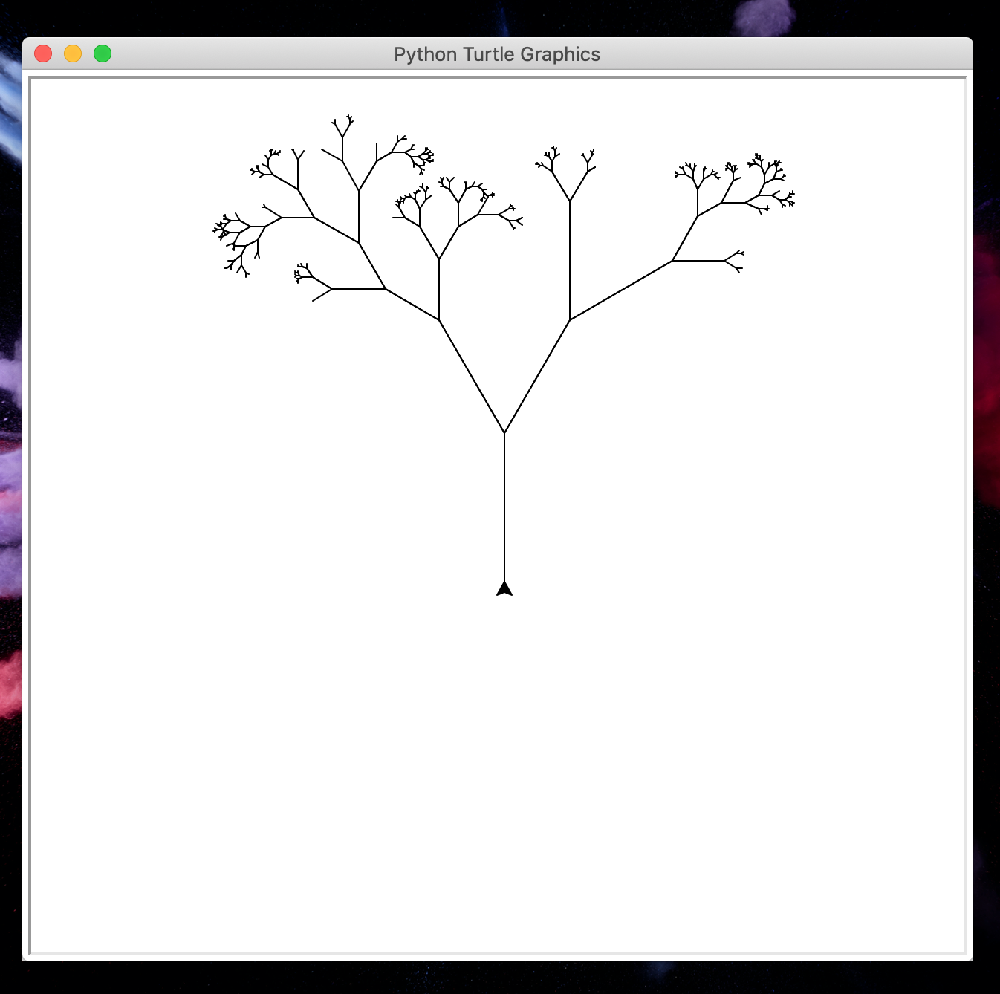
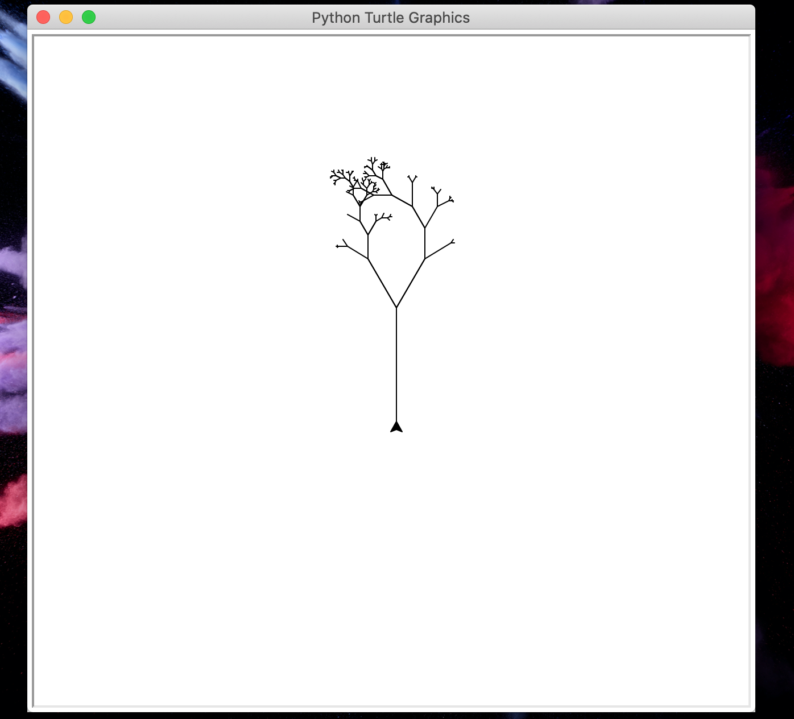
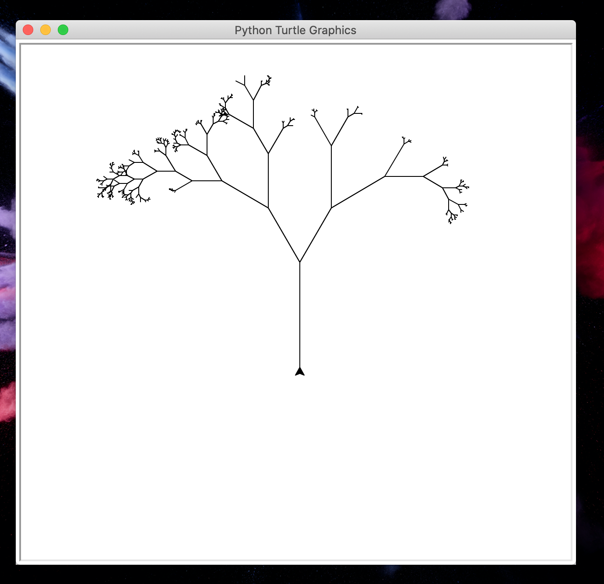
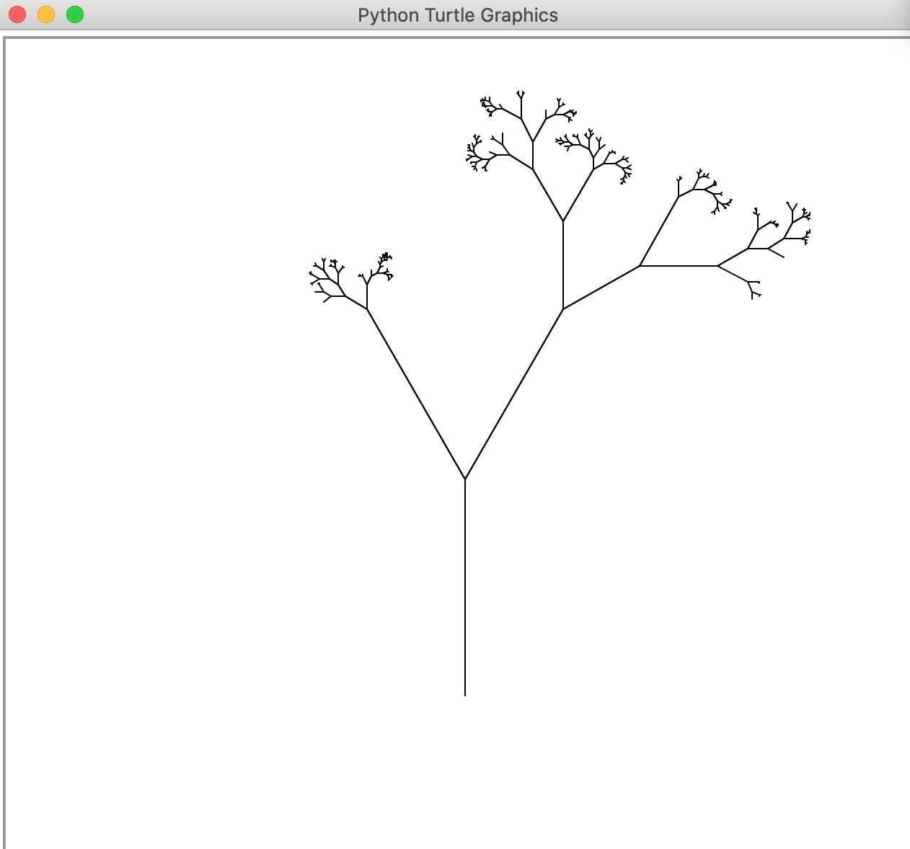
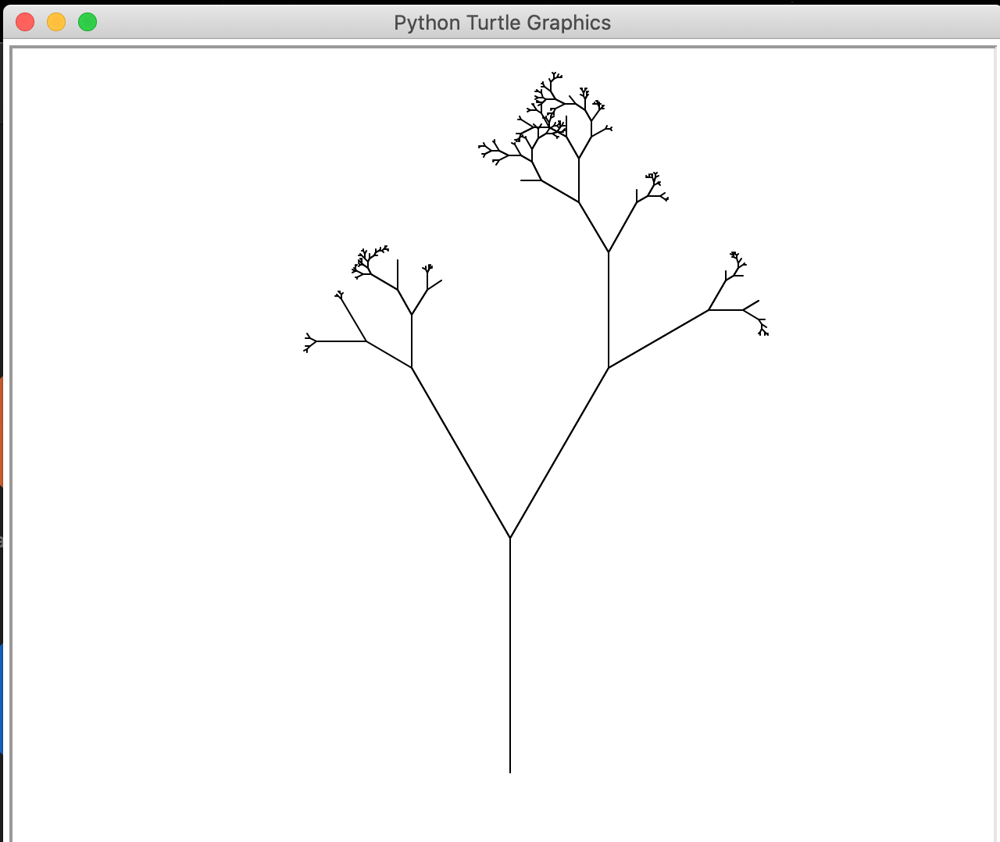
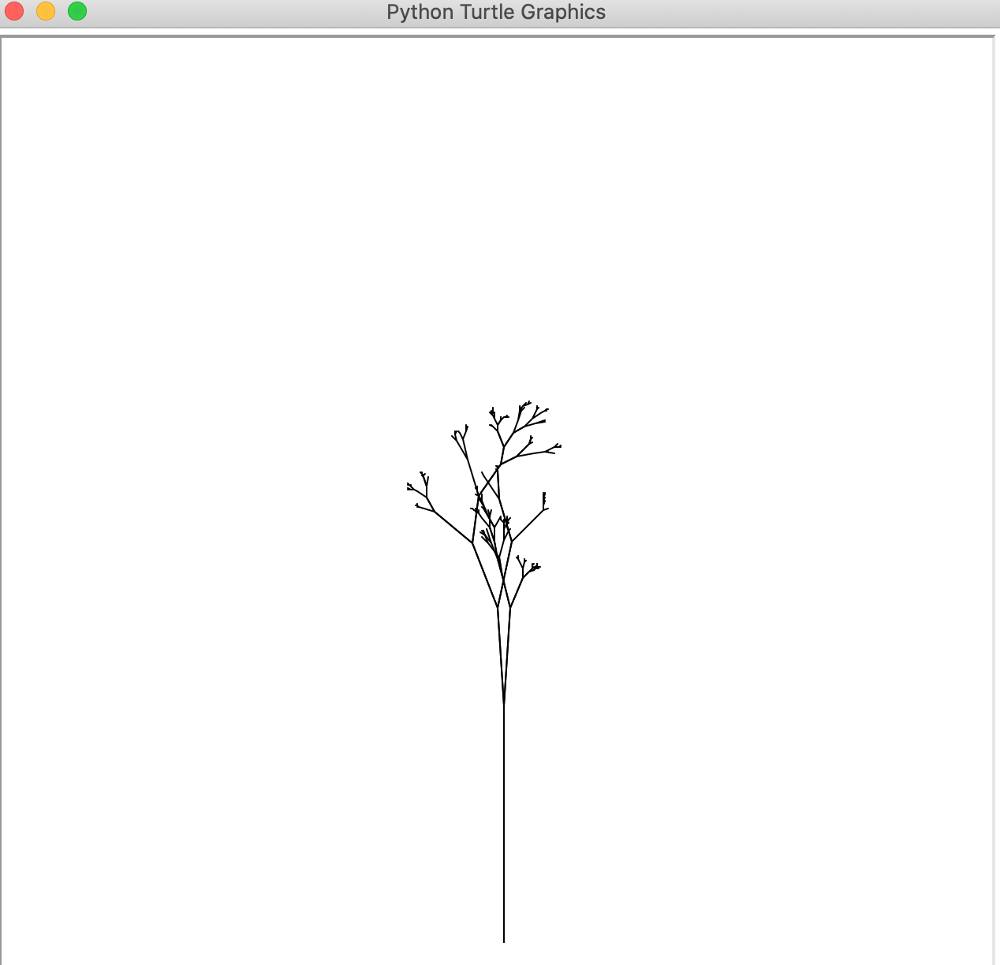
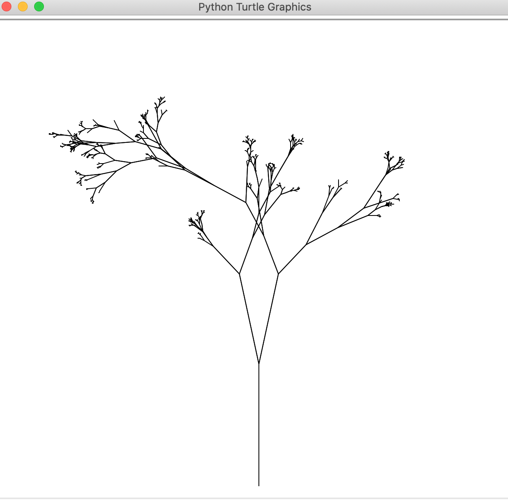

# Natural Tree Design generation through Randomness and Fractal Geometry

This repository contains code and related materials regarding a personal project of mine, where I am exploring the relation between natural tree designs, evolution, entropy, randomness and fractal geometry. The project is a WIP and this repo will be updated hopefully every other week. If anyone wants to know more about the project, please contact me.

## Idea

If you start from a v-shaped fractal you get a very symmetric tree structure after a few iterations, however, in real life, trees aren't this symmetric as branch sizes are different, branch numbers are different, point at which new branches added are different (this is all in a simplified 2D version of a tree). So what I am thinking about is, can limiting and optimizing factors from nature contribute to this degree of disorder from the initial fractal shape? If there is a certain correlation then there should be a certain distributions that one could find for all trees based on the initial conditions

Imagine we study this one particular specie of tree and develop a fractal model that has high order and symmetry, then we study tree samples of that species. We record the following branch sizes, vertical and horizontal distances at which branches and sub-branches grow, and the number of branches/sub-branches. Then after recording these data, we compare the configurations of our sample to the ideal fractal model, and then assign the different configurations different "disorder" values depending on how different the parameters are from the ideal case. After that if we plot of these frequency against these "disorder values", I imagine we would get kind of a off center Gaussian (this is just a very bold guess). Once, we have this peak value, we can try and do a similar analysis of the previous generations of these species peak value. I imagine, if natural selection, is at play at causing these "disorder" values then we can derive an equation that models this peak values over time, and hence predict these "disorder" values of the future generations. This, would in theory, give us a model of predicting evolution trends.

One last thing, using an alternative version of this fractal model, can we not use big data and machine learning algorithms to train model how these simple initial fractal shapes repeat itself to create these complicated natural structures. I believe a strong model of such an idea can explain why numbers like 23 generations are involved in lungs, which is indeed very much tree like

## Video of program
[youtube link](https://www.youtube.com/watch?v=96KpzM2Y4sg)

## Pictures of Generated Trees

Before random angles.

After random angles.

## Issues

- [ ] Need to fix the Y splitting of trees
- [ ] Need to incorporate certain optimization equations that capture the finite resource available to plants
- [ ] Need to derive how random number sets depend on such optimization equations
